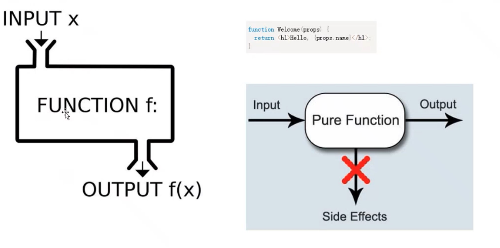

# 03 Oct 2023 - Lecture
## React 哲学 Part 5(Context, Routing & Redux)

### Class component, function component, hooks and useEffext

- Hooks几个原则
    - 不在循环，条件或嵌套函数中调用Hooks: Hook必须始终在函数的顶层被调用，以确保每次渲染都按照相同的顺序调用他们。

    - 只从React函数组件中调用Hooks:不要在常规的JavaScript函数中调用Hooks。你可以在React函数组件中直接调用它们，或者在自定义Hook中调用每个Hook都有自己的目的和用法:
        - `useState`:让函数组件能够使用状态
        - `useEffect`:执行有副作用的操作，如数据获取、手动修改DOM、订阅等
        - `useContext`:让你可以访问Context的值。
        - `useReducer`:提供了一种在函数组件中管理更复杂的状态逻辑的方法 
        - `useCallback`:返回一个记忆化的回调 
        - `useMemo`:返回一个记忆化的值。
        - `useRef`:获取DOM元素或持久化变量的引用
        - `useLayoutEffect`: 与`useEffect`类似，但它会在所有DOM变更之后同步触发
        - `uselmperativeHandle`:用于在使用`forwardRef`时自定义暴露给父组件的实例值
    - 每个Hook可能有自己的依赖数组: 例如，`useEffect.useMemo`和`useCallback`这些Hook都接受一个依赖数组，当这些依赖发生变化时，相关的逻辑才会重新执行
    - 自定义Hook: 你可以创建自己的Hooks，以复用状态逻辑之间的不同组件。自定义Hook是一个函数，名称以`use`开头，该函数内部可以调用其他的 Hook
    - 不破坏组件之间的隔离:每个组件都维持其独立的Hook状态和逻辑，这意味着在一个组件中的Hook更新不会影响到其他组件。
- `useReducer`
    `useReducer` is a hook in React that is used for managing and handling complex state logic in React components. It is especially useful when you have complex state logic that involves multiple sub-values or when the next state depends on the previous one.
    
    It provides an alternative to the `useState` hook for managing state in a more structured way. While useState is great for handling simple states, `useReducer` shines in scenarios where state updates can be expressed as actions.
    `const[state, dispatch] = useReducer(render, initialState);`
    
    
- Context
    Context provides a way to pass data through the component tree without having to pass props down manually at every level 
    - When to use Content: Contexts design to share data that can be considered “global” for a tree of React component
    - Before you use Context: Contex xt is primarily used when some data needs to be accessible by many components at different nesting levels.
    - How to use context
        - Create a new context:
            `export const myContext = React.creatContext({ name: "" });`
        - Create a Context provider
        ```javascript
        <myContext.Provider value={{ name: "lily" }}>
            <ContextTest01></ContextTest01>
        </myContext.Provider>
        ```
        - Consume the Context value, you can access the context value in a component by using the Consumer component or the `useContext` hook.
        ```javascript
        function ContextText02() {
            const contextname = useContext(myContext);
            return <div>{contextName.name}</div>
        }
        ```
        
        
- Routing
    React Router is a fully featured client and server-side routing library for React, a JS library for building user iinterfaces. React Router runs anywhere React runs, on the web, on the server with nodejs, and on React Native.
    - URL
        The URL in the address bar. Many use the term "URL" and "route" interchangeably, but this is not a route in React Router, it's just a URL.
    - Location:
        This is a React Router specific object that is based on the built-in browser's window.location(react-router-basic) object. It represents "where the user is at". It's mostly an object representation of the URL but has a bit more to it than that.
    - Instal react router
    `npm install react-router-dom`
    - `BrowserRouter`
    <BrowserRouter> is the recommended interface for running React Router in a web browser.
    A `<BrowserRouter>` stores the current location in the browser's address bar using clean URLs. It navigates using the browser's built-in history stack.
    
    - Link
        A `<Link>` is an element that lets the e user navigate to another page by clicking or tapping on it. In react-router-dom, a `<Link>` renders an accessible `<a>` element with a real href that points to the resource it's linking to.

        This means that things like right-clicking a `<Link>` work as you'd expect. You can use `<Link reloadDocument>` to skip client side routing and let the browser handle the transition normally (as if it were an `<a href>`).
        ```javascript 
        function App() { 
            return (
                <div className="App">
                    <ul>
                        <li><Link to={"/"}>Main</Link></li>
                        <li><Link to={"/user"}>User</Link></li>
                        <li><Link to={"/tesRd"}>TesRd</Link></li>
                    </ul>
                    <Routes>
                        <Route path={"/"}element={<Main />} />
                        <Route path={"/user"} element={<User />} />
                        <Route path={"/tesRd"} element={<TesRd />} />
                    </Routes>
                <hr/>
                <Navigate01></Navigate01>
                </div>
            );
        ```
        
    - Route
        `<Routes>` and `<Route>` are the primary ways to render something in React Router based on the current location. You can think about a `<Route>` kind of like an if statement; if its path matches the current URL, it renders its element! The `<Route caseSensitive>` prop determines if the matching should be done in a case-sensitive manner (defaults to false).

        Whenever the location changes, <Routes> looks through all its children <Route> elements to find the best match and renders that branch of the UI. `<Route>` elements may be nested indicate nested UI, which also correspond to nested URL.
        
    - Navigate
        A Navigate element changes the current location when it is rendered. It's a component wrapper around `useNavigate` and accepts all the same arguments as props.
        ```javascript
        import {{useNavigate} from 'react-router-dom';
        function Navigate01(){
            const navigate = useNavigate();
            const handleButtonClick =() => { 
                navigate('/target-path');
            };

            return <button onclick={handleButtonClick>Go to Target</button>;
        }
        
        export default Navigate01;
        ```
    - `useParams`
        `useParams` is a hook that allows you to access the dynamic segments of the URL, commonly known as "route parameters".
        When you define a route with React Router, you might specify parts of the URL as variables.
        
    - Outlet
        An `<outlet>` should be used in parent route elements to render thwir child route elements. This allows nested UI to show up when child routes are rendered. If the parent route matched exactly, it will render a child index route or nothing if there is no index route.
    - Nested Routes
        With React Router, this is all built-in. Nested routes add both segments to the URL and layouts to the UI hierarchy. As the URL changes, your layouts automatically change with it.
        
- Uncontrolled and controlled Components
 The uncontrolled component is the alternative for controlled component, where form data is handled by the Dom itself.
 `<input type="text" value={this.state.value} oncl hange={this.handleChange} />`
 `<input type="text"defaultValue="default" ref={ this.inputRef} />`

    In an uncontrolled component, a defaultValue attribute is used instead of value. Changing the value of defaultValue attribute after a component has mounted will not cause any update of the value in the Dom.
- Uncontrolled Components
    - The file input tag
        In React, an `<input type="file" />` is always an uncontrolled component because its value can only be set by a user, and not programmatically.
- Other Advanced Concepts-Forwarding Refs
    - Ref forwarding is a techinique for automatically passing a ref through a component to one of its children.
- Other Advanced Concepts-Fragments
    - Fragments let you group a list of children without adding extra nodes to the DOM.
- Other Advanced Concepts-Script Mode
    StrictModeis a tool for highlightir ng potential problems in an application.
    - **Identifying** components with un safe lifecycles.
    - **Warning** about legacy string ret APl usage. 
    - **Warning** about deprecated find dDOMNode usage.
    - **Detecting** unexpected side effe cts by "double-invoking" the methods.
    - **Detecting** legacy context API.
    
- Other Advanced Concepts-Portals
    - React Portals provide a way to render children into a DOM node that exists outside the DOM hierarchy of the parent component. This is especially useful for cases where a child component needs to break out of its parent container, for example in modals, popups, or tooltips.
    - The primary API for portals is `ReactDOM.createPortal`