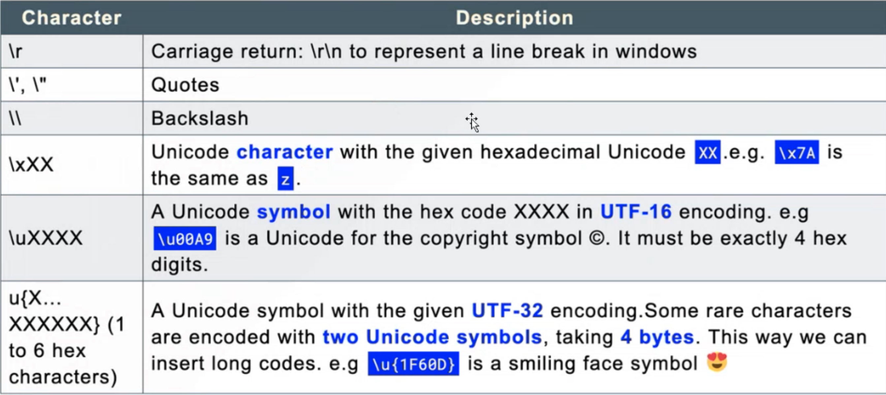

# 03 Sep 2023 - Lecture
## Advanced JavaScript

- Definition of JS
    - JavaScript is a scripting or programming language that allows you to implement complex features on web pages.
    - Import JS
        ```
        <html>
        <head>
            <script>
                alert('Hello World');
            </script>
        </head>
        <body>
            ...
        </body>
        </html>
        ```
        OR
        ```
        <html>
        <head>
            <script src="/static/js/xxx.js"></script>
        </head>
        <body>
            ...
        </body>
        </html>
        ```
- Variables: let&const(ES6)
    Variable is a 'named storage' for data. Variables can be thought of as named containers. You can place data into these containers and then refer to the data simply by naming the container.
    > Declare a variable.
    > Assign a value to a variable.
    > Use a variable.
    - Variable naming:
        - The name contains only `letters`, `digits`, `symbols $`, and `_`.
        - The first character can not be a digit.
        - The reserved names can not be used such as `let`, `class`, `return`,`function`.
        - The name is case-sensitive
        - `Non-latin` letter are allowed, but not recommended.
    - `var`, `let` and `const`
        - `var` declarations are globally scoped or function scoped while `let` and `const` are block scoped. 
        - `var` variables can be updated and re-declared within its scope; 
        - `let` variables can be updated but not re-declared; 
        - `const` variables can neither be updated nor re-declared. They are all hoisted to the top of their scope. 
- 编译器推荐
    VS Code + extensions或Codepen平台
    
- **Data Type**
    - JavaScript does not distinguish between `integers` and `floating` point numbers, they are uniformly represented as Number, and the following are legal Number types: `123`, `0.456`, `1.23456e3`, `-99`, `NaN`(Not a Number), `Infinity`, `1+2`, `(1+2)*5/2`, `2/0`(Infinity), `0/0`(NaN), `10%3`, `10.5`
    - **不同进制示例**：
    ```javascript
    // 基础示例
    const hex1 = 0xFF; // 255 in decimal
    const hex2 = 0x10; // 16 in decimal
    const hex3 = 0x1a; // 26 in decimal
    
    //转换示例
    // Decimal to Hex
    const decimalNumber = 255; // 'ff'
    const toHex = decimalNumber.toString(16);
    
    //Hex to Decimal
    const hexNumber = 'ff';
    const toDecimal = parseInt(hexNumber, 16); //255
    ```
    
    ```javascript
    //二进制
    const binary1 = 0b1010; // 十进制的10
    const binary2 = 0b1101; // 十进制的13
    
    //八进制
    const octal1 = 0o12; // 十进制的10
    const octal2 = 0o15; // 十进制的13
    ```
    
    ```javascript
    //如果要将0b和0o前缀的字符串数值转为十进制，要使用Number方法。
    console.log(`7 is ${Number('0b111')}`) // 7
    console.log(`8 is ${Number('0o10')}`) // 8
    
    // 十进制转二进制
    const decimalToBinary =(10).toString(2);// 输出“1010”
    console.log(`Decimal to Binary: ${decimalToBinary}`);

    // 十进制转八进制
    const decimalTo0ctal = (10).toString(8);// 输出"12"
    console.log(`Decimal to Octal: ${decimalTo0ctal}`);

    // 二进制转十进制
    const binaryToDecimal = parseInt('1010'，2);// 输出 10
    console.log(`Binary to Decimal: ${binaryToDecimal}`);

    // 八进制转十进制
    const octalToDecimal = parseInt('12',8);// 输出 10
    console.log(`0ctal to Decimal: ${octalToDecimal}`);
    ```
    
    ```javascript
    //isFinite()这个函数测试一个数值是否是有限的
    //注意:isFinite()会先尝试将一个非数字值转换为数字，然后再进行检查。 
    console.log(isFinite(Infinity0); // false
    console.log(isFinite(NaN)); / false 
    console.log(isFinite(-Infinit y)); // false
    console.log(isFinite(0)); // true I 
    console.log(isFinite(2e64)); // true 
    console.log(isFinite("0")); / true，会先转换为数字
    ```
    
    ```javascript
    console.log(+"100px");
    console.log(4 + "5");//."45"(数字被转换成字符串进行连接操作)
    console.log(1 == "1"); //·true console.log(1 === "1");//false

    console.log(parseFloat('42')); // 输出 42
    console.log(parseFloat('42.7'));// 输出 42.7
    console.log(parseFloat('42.7.8'));// 输出 42.7，解析停止在第二个点
    console.log(parseFloat('abc42'));// 输出 NaN，因为第一个字符不是数字或点 
    console.log(parseFloat('0.0042')); // 输出 0.0042
    ```
    
    - **Numbers**
        `parseInt()` function has an optional second parameter. Ot specifies the base of the numeral system, so parseInt can also parse strings of `hex numbers`, `binary numbers` and so on.
        ```javascript
        
        console.log(parseInt('42'));// 输出 42
        console.log(parseInt('42.7'));// 输出 42，省略了小数部分
        console.log(parseInt('42abc'));// 输出 42，解析停止在非数字字符
        console.log(parseInt('abc42'));// 输出 NaN，因为第一个字符不是数字
        console.log(parseInt('0x42'));// 输出 66，0x表示十六进制
        console.log(parseInt('42'， 10));// 输出 42，明确指定十进制
        ```
    - Strings
        - Special Characters
        
        - Examples
        ```javascript
        
        let sentence = "He said, \"JavaScript is fun!\"";
        console.log(sentence);// 输出: He said, "JavaScript is fun!"
        
        let sentence01 = 'It\'s a beautiful day!';
        console.log(sentence01);// 输出: It's a beautiful day!
        
        let sentence02 ="This is the first line.\nThis is the second line."; console.log(sentence02);
        // 输出:
        // This is the first line.
        // This is the second line.
        
        let sentence03 ="Column1\tColumn2\tColumn3";
        console.log(sentence03);
        // 输出:Column1 Column2 Column3 
        //ASCII字符可以以\x##形式的十六进制表示 
        console.log("\x41"); //A
        
        //还可以用\u####表示一个Unicode字符:
        console.log("\u4e2d\u6587"); //中文

        ```
        - 模板字符串示例：
        ```javascript
        //模板字符串
        function greet(name) {
            console.log(JHi ${name}!
        }
        greet("lily")
        let name ="张三";
        let message =`你好，${name}!欢迎来到JavaScript的世界。`
        console.log(message);
        let multiLineString = `This is line 1 
        This is line 2`;
        
        console.log(multiLineString);
        //多行字符串-ES6
        `这是一个
        多行
        字符串`
        ```
    - Arrays
    以存储多个值，并可以包含任意类型，并可以通过索引来访问元素
    ```javascript
    const arr = [1, 2, 3, 4, 5];
    console.log(arr[0]);
    ```
    
    > 支持很多方法例如`push`, `pop`, `shift`, `unshift`, `indexOf()`, `reverse()`, `sort()`, `join()`, `remove`.
    > splice()是修改array的万能方法
    
- Type-map
    `map` is a collection of keyed data items, just like an `object`. But the main difference is that Map allows keys of any type.
    - 常见的方法：
    `new Map()`, 
    `map.set(key, value)`, 
    `map.get(key)`, 
    `map.has(key)`, 
    `map.delete(key)`, 
    `map.clear()`, 
    `map.size`
    ```javascript
    var m = new Map();
    ```
> `set`和`map`基本相同，只是set中的键是不重复的

- Looping over arrays:
    - Using a `for` loop
    - Using `foreach`
    - Using `for...of`(ES6)
    - Using `for...in`
- Functions
    - Arguments
    - Arrow Function(ES6)
    - Callback Function
- Objects
    JavaScript is designed on a simple object-based paradigm. An object is a collection of properties, and a property is an association between a name (or key) and a value. A property's value can be a function, in which case the property is known as a method
    >The most generat type for complex data structures. Objects can hold other data types, including other objects as properties.
    - Creation:
        There are different ways to create new objects:
        - Create a single object, using an object literal.
        - Create a single object, with the keyword new.
        - Define an object constructor, and then create objects of the constructed type.
        - Create an object using Object.create().
- Destructuring(ES6)
    The destructuring assignment syntax is a JavaScript expression that makes it possible to unpack values from arrays, or properties from objects, into distinct variables.
    ```javascript
    var [x, y, z] = ['hello', 'js', 'ES6'];
    
    var [x, [y, z]] = ['hello', ['js', 'ES6']];
    
    var [,, z] = ['hello', 'js', 'ES6'];// 忽略前两个元素，只对z赋值第三个元素
    ```
    
    ```javascript
    // 使用场景1
    var x = 1;
        y = 2;
    [x, y] = [y, x];
    ```
    
    ```javascript
    // 使用场景2
    function buildDate({
        year,
        month,
        day,
        hour = 0,
        minute = 0,
        second = 0
    }) {
        return new Date(year + '-' + month + '-' + day + '-' + hour + ':' + minute + ':' + second);
        }
        
    ```
    

    
- Function
    In JS, a function is a block of code designed to perform a particular task. Functions are one of the fundamentak building blocks in JS, allowing code to be called multiple times, potentially with different arguments, resulting in differennt results.
    A funnction is defined with the function keyword, followed by a name, followed by parentheses`()`. The code to be executed by the function is placed by the function os placed inside curly brackets `{}` and as long as one of them is true, the result of the `||` operation.
    ```javascript
    function greet() {
        console.log("hello world");
    }
    ```
    
    ```javascript
    function foo(x) {
        if(x >= 0) {
            return x;
        } else {
            return -x;
        }
    }
    ```
    
    ```javascript
    //匿名函数
    var foo = function (x) {
        if(x >= 0) {
            return x;
        } else {
            return -x;
        } 
    }
    ```
    
    ```javascript
    // 箭头函数
    const greet = () => {
        console.log("hello world");
    }
    ```
    
    > 免费赠送的关键字`arguments`
    类似array但是却不是array因为`arguments`不支持array的方法调用，只能做索引在function中使用，还可以使用`arguments.length`来判断传入参数的个数。
    
    ```javascript
    function myFunction() {
        console.log(arguments[0]);
        console.log(arguments[1]);
        console.log(arguments.length);
    }
    
    myFunction("arg1", "arg2", "arg3");
    // output: "arg1", "arg2", 3
    ```
    
    ```javascript
    // 推荐 ...args剩余参数（rest parameters）
    function myFunction(...args) {
        console.log(args[0]);
        console.log(args[1]);
        console.log(args.length);
    }
    
    myFunction("arg1", "arg2", "arg3");
    // output: "arg1", "arg2", 3
    ```