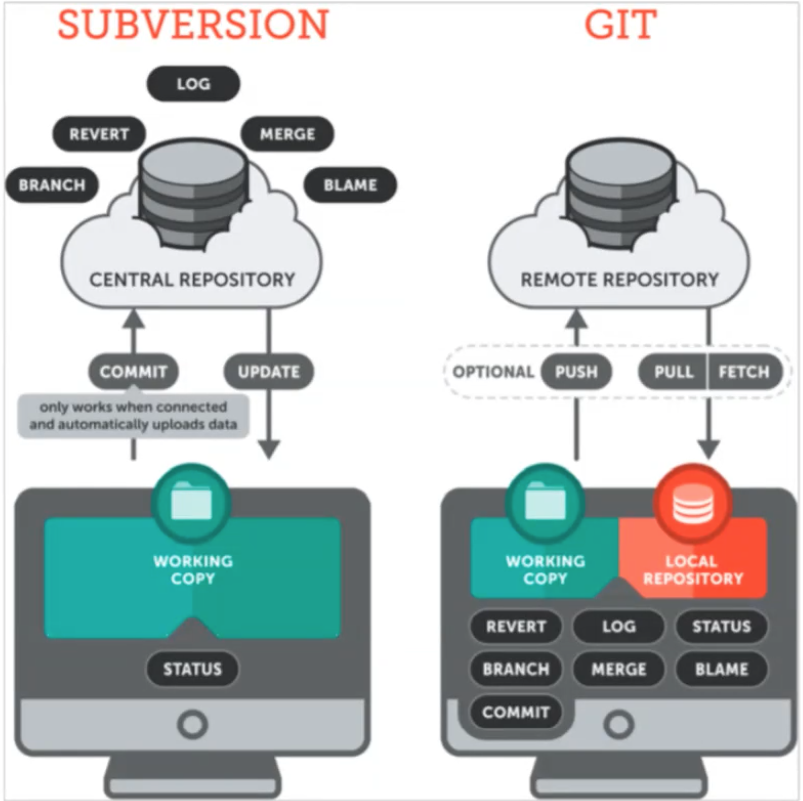
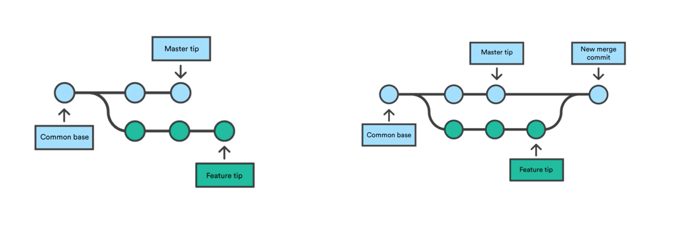
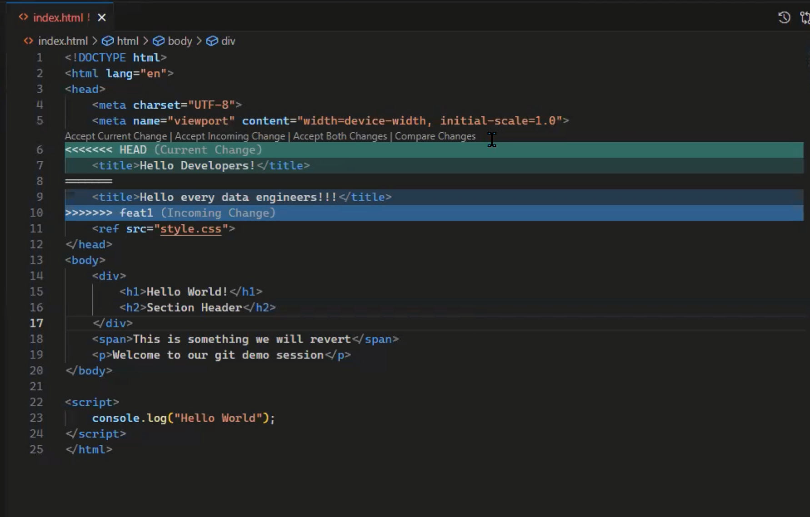
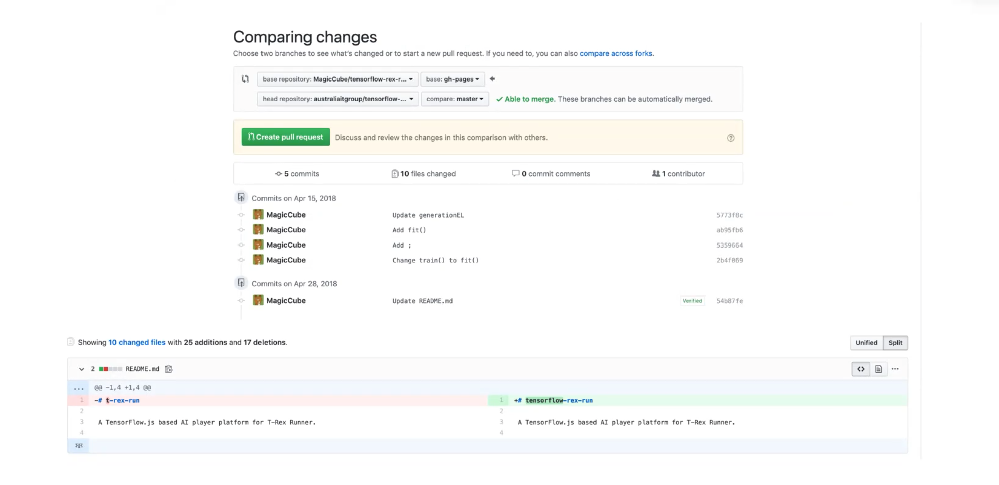
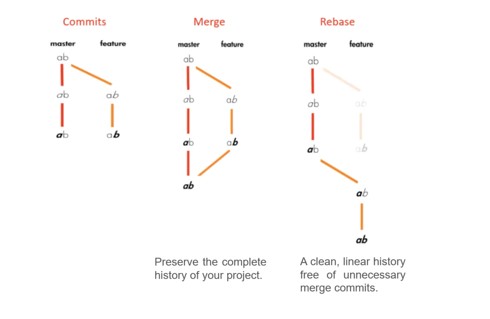
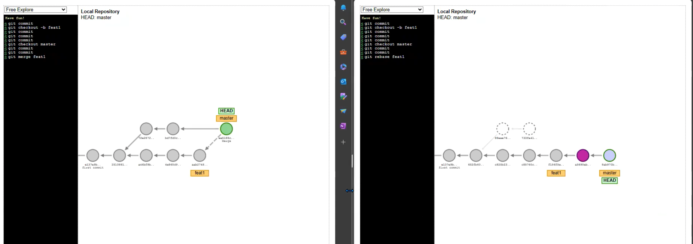

# 12 Sep 2023 - Git Introduction

## Version Control with Git（Microsoft）

- 为什么要使用Git？
    - 撤销改动或者回滚版本(snapshot)
    - 回溯历史(A complete long-term history of every file that provides **traceability**)
    - 协同合作(via branching strategies)
    - 备份

- 分类：Centralized & Distributed

- 如何设置？
    - 本地下载git后 (https://git-scm.com)，打开command窗口运行
        ```git
        git --version
        // 如果显示任何版本则证明git已下载成功
        ```
    - Git global setup:
    ```git
    git config --global user.name "<Your-Full-Name>"
    git config --global user.email "<Your-Email-Address>"
    git config --global color.ui auto
    git config --global merge.configlictstyle diff3
    git config --global core.editor "code --wait"
    ```
    - 可以用 `git config --list` 来查看当前的设置

- Git的本地工作方法
     - 设置好以后，使用`git init` OR `git clone <remote repo>`来将当前目录变成本地的git repo，此时文件中有一个`.git`文件。
    - git工作原理
    
    
- git 命令
    ```git
    // 将改动过的文件添加到stage
    git add .
    // OR
    git add <file>
    
    // 从staged里面取出-unstage
    git rm --staged <file>
    
    // 给stage区域中的改动添加一个commit
    git commit -m "First commit"
    
    // 将本地所有commit/commits同步到远程
    git push
    
    // 删除修改
    git rm
    
    // 缓存抽屉 
    git stash -m ""
    
    // 查看stash记录，每一个stash都有一个编号。
    git stash list
    
    // 删除最后一个stash记录
    git stash pop
    
    // 恢复到第index个stash更改
    git stash apply <index>
    
    // git undo changes
    // 查看更改
    git checkout
    // 撤销当前全部更改
    git checkout .
    
    // 强制执行git clean操作
    git clean -f
    
    // revert操作是用新的commit对历史记录进行回滚
    // 1. 先用git log(press q to quit)查看SHA(Secure Hash Algorithm - 唯一的一个哈希值)，然后复制SHA编号，然后运行接下来的命令进行回滚 - 在历史中是有记录的。
    git revert <your SHA>
    // 查看不同
    git diff <your SHA>
    // 直接删除历史提交记录(慎用)
    git reset
    git reset soft // 将删除的commit仍然保留在staging区域，即仍能看见更改
    git reset hard // 将删除的commit彻底删除，包括所有此commit的更改
    
    // 对上一条commit进行追加更改
    git add .
    git commit --amend --no-edit
    
    // 想要重写commit tree的情况下可以用
    git rebase -i HEAD~3
    ```
    - VS Code图形化界面插件推荐：`Git History`
    - Commit message 要有意义

    
- 使用Git branch进行创建与合并分支
```git
// 查看branch
git branch

// Delete branch
git branch -d 

// 切换到分支
git checkout <branch name>
git checkout -b //如果没有分支名称会创建新的分支

// 合并分支
git merge <branch name that you want to merge to current branch>


```

- 合并分支时的冲突merge conflict
    - 如何解决冲突：在UI中点击accept current change/accept incoming change/<edit yourself and commit>

    - 潜在解决冲突方案：**每天**上班时都将正在工作的分支进行对master的rebase，即`git rebase master` 来对master任何更改的一个同步。
        - On master branch `git pull`
        - On local branch `git rebase master`

    - 如果不想解决冲突(不建议):
        - `git merge <branch name> --abort`
        - `git merge <branch name> --overwrite-ignore`
        - `git merge <branch name> --no-overwrite-ignore`
- 分支名称约定：
    `<type>/<ticket-number>-<title>`
    - 例： `feature/JR-101-create-header-for-home-page`
    - feature
    - fix/bugfix/hotfix

- 使用GitHub进行团队合作
    - `git clone <remote repo url>` // source code AND history
    - `git remote add <name> <url>`
    - `git remote rm <name>`
    - `git remote rename <old-name> <new-name>`
    - 使用`git remote --verbose` 查看remote的信息
    - 如果远程代码有变更，使用`get fetch`查看remote的变化(不会更改本地内容)
    - 如果没有问题可以使用`git pull` 将远程变更更新到本地(master branch)
    - 再回到工作的branch进行`git merge master`

- 创建PR来进行review and merge to master/prod
    - 在PR中进行chat和不断的重新merge
    - 直到当前task完成点击closed


- Ask git to ignore files
    - 配置`.getignore`文件来忽略对source code的管理
    ```git
    *.mp3
    *.mp4
    *.dll
    *.docx
    *.pptx
    */lib/*
    */bin/*
    ```
    
- 两种workflow: rebase & merg
    - rebase会消除历史线路
    - merge会保留历史线路
    - `git rebase -i HEAD~4` 对最近4个节点进行编辑


   
   

- Forch push
    - `git push -f`//强制push - 直接覆盖，不推荐
    - `git push <name> +<branch name>`
    - `git push --force-with-lease`