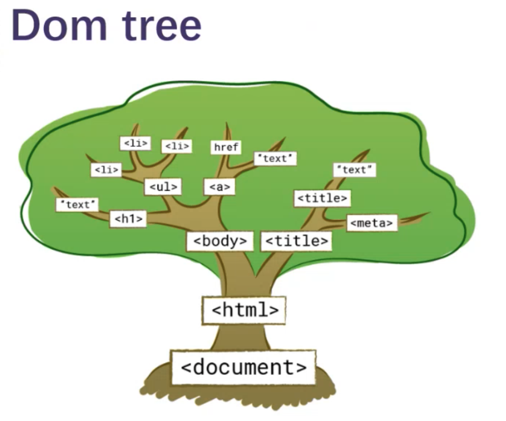
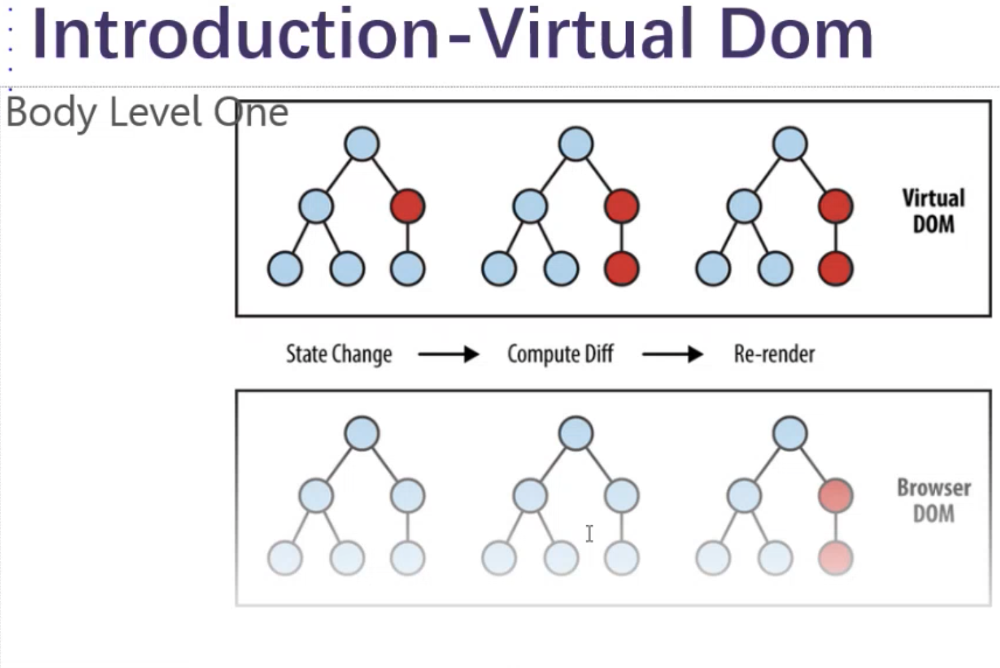
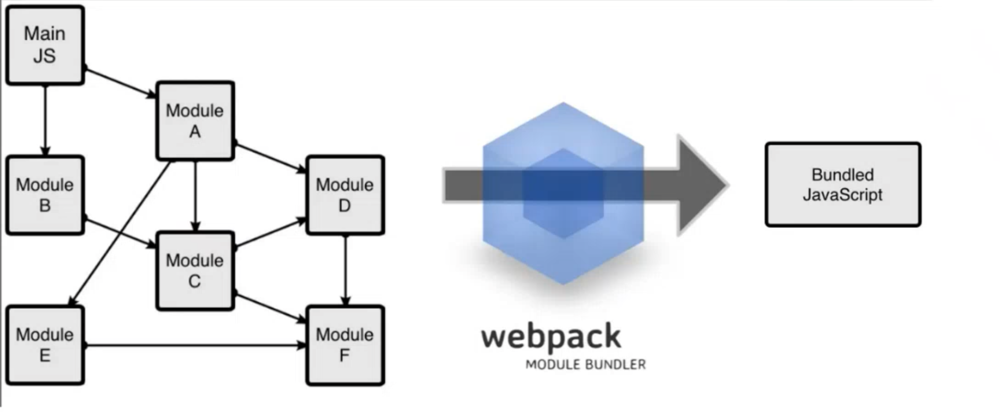

# 19 Sep 2023 - Lecture 
## React哲学Part1 & Part2 (JSX & Components & props)

### React技术栈学习路线图
    - 传统前段基础html+JS+css
    - 新规范html5+ES6,以及如何使用babel等工具将ES6代码转换为ES5代码
    - 现代前端流程化工具
        - npm
        - webpack
        - 使用npm和webpack实现前段工作流，可以结合第三方的脚手架
    - React相关
        - React框架：组件化
        - React Router: 前端路由
        - Redux： 状态管理
    - 控件库
        - MUI
    - 开发工具
        - IDE, VSCode
        - Chrome， Chrome Dev Mode

### React Introduction
        React JS has been the world most popular fronte end framework for years. It has been used by many of big companies such as: Facebook, Instagram, Netflix.
   
    There are so many features and benefits to use React in frontend development. It makes web application development easier for develop ers and also easier for people to learn. Moreover, it is also known to be declarative, pov verful, extensible and component-based(almost everything you render on a web page is a component).
    
    Some other features making many developers cl hoose React are that they support mobile web browser and also server-side rendering.    
    
    - DOM Tree
    
    
> Dom node越多，渲染速度越慢，所以以优化角度来讲要尽量少的创建DOM node

- Install React
    - 首先安装NodeJS和NPM来进行对React和其他的包管理
    - [Install NodeJS](https://nodejs.org/en/download)
        - Check node version with `node -v`
    - [Install NPM](https://www.npmjs.com/package/download)
        - Check NPM version with `npm -v`
    - NPM(Node Package Manager) is a tool that facilitates the management of JS packages. It is widely used in the development of Node.js projects.
        - `npm install <package_name>`
        - `npm uninstall <package_name>`  
    - npm依赖管理文件: `package.json`

- Webpack    
  Webpack is an open-source JavaScript module bundler. It is a popular tool used by web developers to manage and bundle various assets and resources in web applications. Webpack's primary purpose is to take multiple JavaScript files, along with their dependencies, and bundle them together into a single JavaScript file or a few optimized files. However, it can do much more than just JavaScript bundling; it can handle a wide range of assets and resources, including stylesheets, images, and fonts.


    - 使用`npm init -y`来初始化文件夹用于生成package.json文件
    - `npm install -g webpack` // Install globally
    - `npm install --save-dev webpack webpack-cli`//本地安装
    - 在主目录下创建一个`webpack.config.js`
    - 到`package.json`文件中，将以下内容添加进去(添加脚本)
    ```javascript
    "scripts": {
        "build": "webpack"`
    },
    ```
    - 对`webpack.config.json`的解释
    ```javascript
    // 包引用，相当于import
    const path = require('path');
    
    module.exports = { // 开始模块导出
        entry: './src/index.js', // 定义webpack入口，从此开始解析
        output: { // 定义webpack如何输出编译后的文件
            filename: 'bundle,js', // 将所有JS打包到这个文件中
            path: path.resolve(__dirname, 'dist') // 创建一个绝对路径
        }
    };
    ```
    - 打包结束后会自动生成一个`dist`目录其中包含打包好的`bundle.js`文件

### 创建项目

- 创建文件夹
- cmd命令进入文件夹（tips:在文件夹上导航栏直接输入cmd可打开当前文件夹的cmd命令界面）
- 运行`npx create-react-app myfirstapp` 创建名为`my firstapp`的项目
- 其中`node_modules`中包含了所有的依赖包
- react会将`index.js`渲染到`index.html`中
- `package.lock.json`是自动生成的锁定版本的文件，确保每次安装依赖的时候安装相同版本的软件包,只有每次下载新的包的时候才会更新

### Babel工具    
Babel is an open-source JavaScript compiler that is primarily used to convert ECMAScript 2015+ (ES6+) code into a backward-compatible version of JavaScript that can run in older browsers and environments. It is a widely used tool in modern web development to ensure that the latest JavaScript features and syntax can be used while still supporting a wide range of browsers.

Key features and functions of Babel include:
`Transpilation` `Plugin System` `Presets` `Integration with Build Tools` `Support for JSX` `Customization`

> 推荐VSCode扩展：`ES7+ React/Redux/React-Native snippets`

### What is JSX?
- Take a look at the code as follows.
What kind of code do you think it is? Is it HTML?JavaScript?

    The part that looks like HTML,`<h1>Hello world</h1>`, is somethin ng called **JSX**.
    
    It is a syntax extension to Javascript. React uses it to describ be what the UI should look like. JSX puts mark-up in the JavaScript, that makes it look like a template language, and also it comes with the full power of JavaScript.
    
    Syntax extension: In this case, it means that JSX is not valid JavaScript. Web browsers can't read it!

    lf a JavaScript file contains JSX code, then that file will have to be compiled. That means that before the file reaches a web browser, a JSX compiler will translate any JSX into regu ular JavaScript.
`const element = <h1>Hello,world!</h1>;`

- `Attributes` In JSX
    JSX elements can have attributes like HTML emelemtns.
    AJSX attribute is written using HTML-like syntax: a name, followed by an equals sign, followed by a value. The value should be wrapped in quotes like this
    `const p1 = <p id='large'>foo</p>;`
- JSX Features
    - Specifying Children with JSX
        - If a tag is empty, you may close it immediately with `/>`, like
            `const ele =    `
    - JSX tags may contain children:
    ```javascript
    const element = (
        <div>
            <h1>Hello!</h1>
            <h2>Good to see you here!</h2>
        </div>
    );
    ``` 
    
- JS IIFE - Immediately Invoked Function Expression, 是一种编程技巧，允许立即执行一个函数表达式
 ```javascript
 (function() (
    // Code here
 ))();
 
 ```   
 
 ### Class components

- Class components are a staple in React and offer various features tha at help in organizing and managing the logic and UI of your
    
    Render Method: Every class component must have a render method t that returns the JSX to be rendered.
    
    State Management: Class components can contain local state (local st tate), which can be accessed through this.state and updated through this.setState.
    
    Lifecycle Methods: Class components offer various lifecycle methods, such as `componentDidMount`, `componentDidUpdate`,and `componentWillUnmount`, etc., used to execute code at different stage es of the component's lifecycle.
    
    Inheritance: Class components are created by inheriting React.Compo onent, allowing for the use of more methods and properties. Class components are traditionally the way to create React componer nts by use ES6 class
    
- Funtion Components
  Function components are a type of component in React that offers a sumpler and more modern approach to building components in React applications.
  ```javascript
    import React from 'react'
    
    export default function FunctionTest() {
        return (
            <div>FunctionTest</div>
        )
    }
  ```
  
- Props
  Every component has something called props.A component's props is s an object. It holds information about that component.To see a component's props object, you use the expression this.props

    Almost any kind of data can be passed to a component. You can pass string, number, array, object, function, or even another component, to one component.

    Props are Ready-only, whether you declare a component as a functior n or a class. It must never modify/mutate its own props.  
  
  - Good example:
    ```javascript
    //pure function
    function sum(a, b) {
            return a+b;
    }
    ```
  - Bad example:
    ```javascript
    // impure function, account is mutated / modified
    function withdraw(account, amount) {
        account.total -= amount;
    }
    ```    