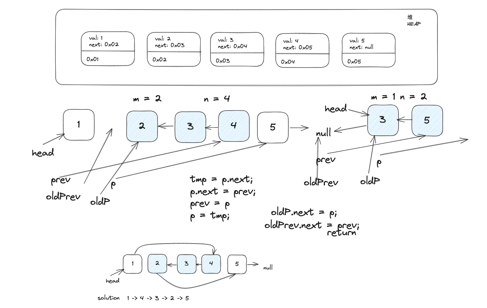
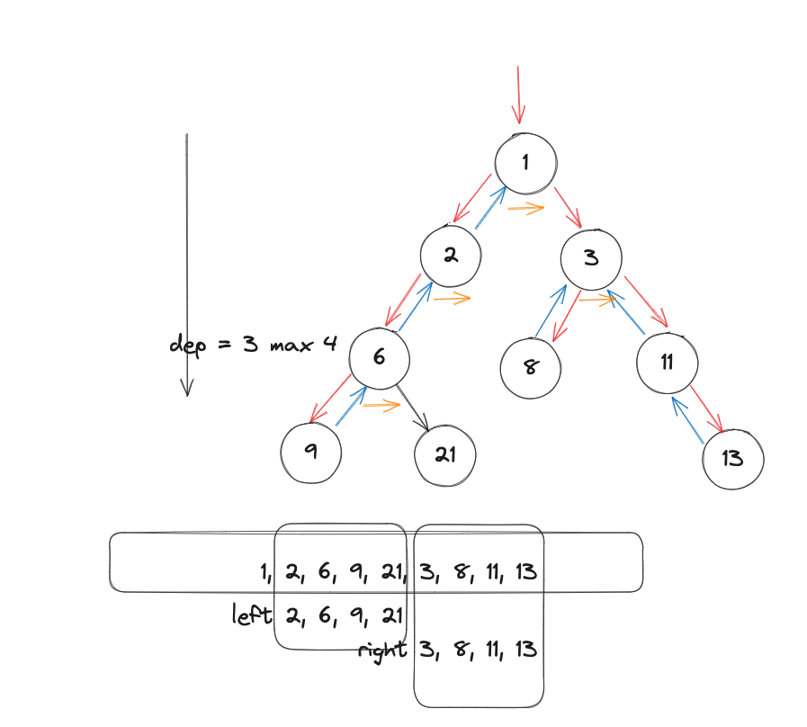

# 22 Aug 2023 - Lecture
## 二叉树及其拓展

- 续上节课的指针问题解题思路
    LeetCode - 92 Reverse Linked List II
    


- 二叉树的遍历
    - 方式：前序，中序，后序

```
public class Bottles {
    class TreeNode {
        int val;
        List
        TreeNode left;
        TreeNode right;
    }
    
    public stativ void main(String[] args) {
        
    }
```

- 前序遍历：（Preorder Traversal）
    在前序遍历中，首先访问根节点，然后递归地遍历左子树，最后递归地遍历右子树。遍历的顺序是先根节点，再左子树，最后右子树。
    


- 中序遍历：（Inorder Traversal）：
    在中序遍历中，首先递归地遍历左子树，然后访问根节点，最后递归地遍历右子树。遍历的顺序是先左子树，再根节点，最后右子树。中序遍历在二叉搜索树中得到的结果是有序的。

- 后序遍历：（Postorder Traversal）：
    在后序遍历中，首先递归地遍历左子树，然后递归地遍历右子树，最后访问根节点。遍历的顺序是先左子树，再右子树，最后根节点。

- 递归解题思路
    1. 把问题分解为子问题
    2. 假设子问题的解已经存在
    3. 根据子问题的解，去解决问题
    4. 确定递归的终止条件
    5. 千万不要跳进递归去试图解决问题
