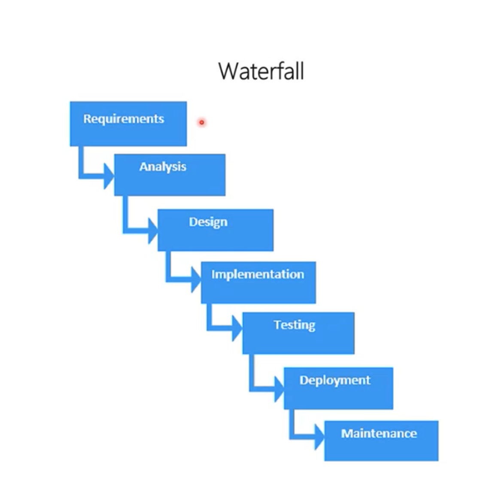

# 23 Sep 2023 - Lecture
## Agile Scrum

### Software Development Lift Cycle(SDLC)
- SDLC
    - Envision - Idea
    - Design - Specs/Docs
    - Build - Code/Infra/Config
    - Stabilize Test/DAT/BAT/UAT/Defect-fix
    - Deploy
    - Production Executables/Online Services/Support Docs
    - Support Bug-fix/Patch/Updates
    - End of Life - EOL
- SDLC Model - Waterfall & V Model
    - Waterfall (古老方法，现在基本已经被淘汰)

    - V Model
    

    - Agile
    
        Agile project management is an interative development methodology that values human communication and feedback, adapting to changes and producing working results.
        

    - 敏捷开发是一种理念/精神/价值观，而并不提供具体的方法
    - Agile的原则是：
        - 减少浪费
        - 快速产出
        - 不断迭代
        - 交流沟通
        - 相应变化
    - Agile values
    
| Agile  |  OVER  | Description |
| -----------| ----------- | ----------- |
| Individuals | over | Processes and Tools |
| Working Product | over | Comprehensive Documentation |
| Customer Collaboration | over | Contract Negotiation |
| Resonding To Change | over | Following a Plan |

That is, while there is value in the items on the right, we value the items on the left more.

- **12** Agile principles behind the agile manifesto
    - Satisfy the custom30 Oct 2023er through early and continuous delivery of valuable software.
    - Welcome changing requirements, even late in development. Agile processes harness change for the customer's competitive advantage.
    - Deliver working software frequently, with a preference for shorter timescales.
    - Collaborate daily with the customer and stakeholders throughout the project.
    - Build projects around motivated individuals. Give them the environment and support they need, and trust them to get the job done.
    - The most efficient and effective method of conveying information to and within a development team is face-to-face conversation.
    - Working software is the primary measure of progress.
    - Agile processes promote sustainable development. The sponsors, developers, and users should be able to maintain a constant pace indefinitely.
    - Continuous attention to technical excellence and good design enhances agility.
    - Simplicity—the art of maximizing the amount of work not done—is essential.
    - The best architectures, requirements, and designs emerge from self-organizing teams.
    - At regular intervals, the team reflects on how to become more effective, then tunes and adjusts its behavior accordingly.

- Agile Methodologies
    - Scrum
        Scrum is a framework within people can address complex problems, while productively and creatively delivering products of the highest possible value.
        Scrum is: Lightweight tool for enabling business agility. Simple to understand, yet difficult to master.
        3355
        - Roles:
            - Product Owner
            - Development Team
            - Scrum Master
        - Artifacts
            - Product Backlog
            - Sprint Backlog
            - Increment
        - Events:
            - Sprint
            - Sprint Planning
            - Daily Scrum
            - Sprint Review
            - Sprint Retrospective
        - Value propositions:
            - Commitment
            - Focus
            - Openess
            - Respect
            - Courage
    - Scrum Retrospective Meeting
        - Definition: A retrospective is a meeting held after a product ships to discuss what happened during the product development and release process, with the goal of improving things in the future based on those learnings and conversations.

        - What is the ideal outcome of a retrospective meeting?
            
            Every retrospective should at a minimum result in a list of “things that went well" and “things that could use improvement." Those lists may not be particularly long and exhaustive, but each project probably has a few standouts in each column.
            
    - Scrum Master
        - Scrum process mgmt
        - Team protection
        - Effective communcation
        - Quality check
        - Progress tracking
        - Team building
    - Kanban 

    

- Agile backlog
    In Agile development, a product backlog is a prioritized list of deliverables (such as new features) that should be
implemented as part of a project or product development.

Think of a product backlog as a wish list - not a to-do list.

This backlog is often fed by a strategic roadmap, then divided into themes, epics, sprints, and user stories. Most include items that would be completed within the next quarter or fiscal year.

- Product Backlog Items(PBIs)
    - Features
        - User stories - New features = persona+need+purpose
        - Use cases
        - Free form text
    - Defects
    - Technical work
    - Knowledge acquisition
    - Examples: Technical Debt/Bugs/Research

- Azure DevOps
    
- Firms today experiences a much higher velocity of business changes. Market opportunities appear of dissolve in months or weeks instead of years.

- What changes?

- Key changes
    - We changed our approach to people
    - We changed how we plan & learn
    - We created new ways to stay healthy
    - Our engineering envolved to align with our culture

- Benifits    
    - Dependencies between teams are minimized
    - Teams learn how to work together
    - We always have cross-discipline ownership
    - Teams have autonomy
    - Progress is shared continually
