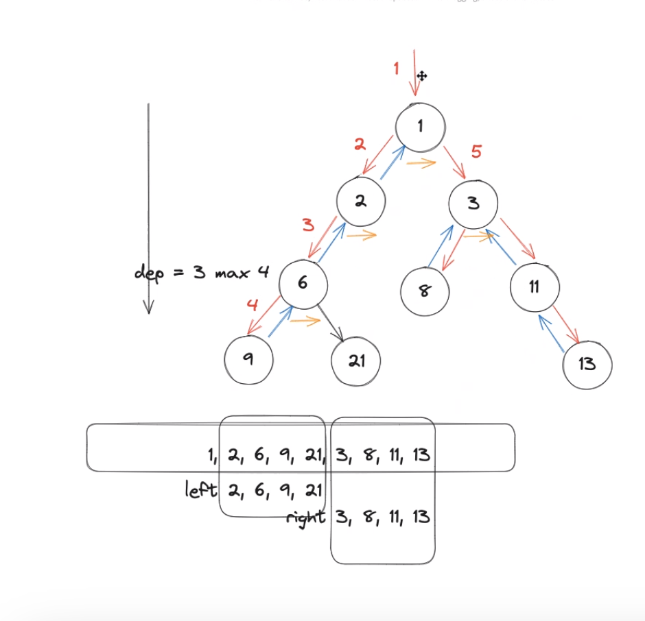
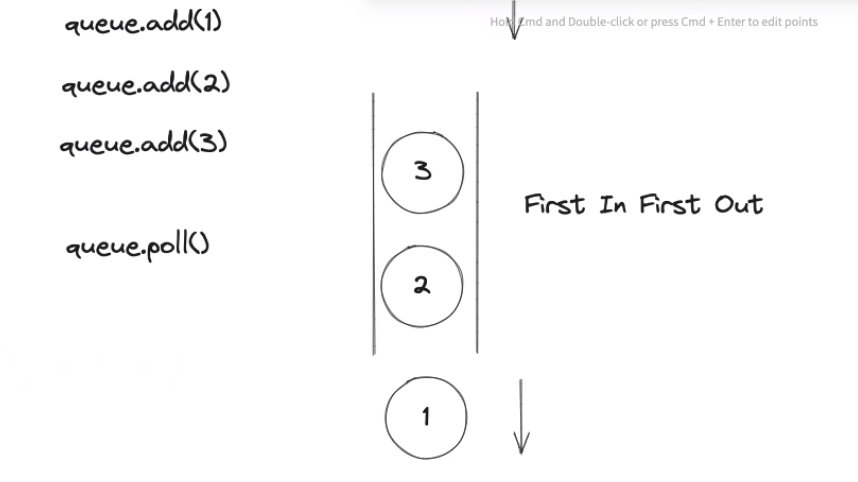

# 27 Aug 2023 - Lecture
## Recall LeetCode:
- 206 操作指针:
``` java
class Solution {
    public ListNode reverseList(ListNode head) {
        ListNode p = head;
        ListNode prev = null;
        while (p != null) {
            ListNode tmp = p.next;
            p.next = prev;
            prev = p;
            p = tmp;
        }
        return prev;
    }
}
```

- 206 递归解法：
```java
class Solution {
    public ListNode reverseList(ListNode head) {
        if( head == null) return head;
        if(head == null || head.next == null) return head;

         ListNode res = reverseList(head.next);
         head.next.next = head;
         head = null;
         return res;
    }
}
```

- 二叉树： 104题：
```java
class Solution {
    int depth = 0, max = 0;

    void traverse(TreeNode root) {
        if(root == null) return;
        //preorder
        depth++;
        max = Math.max(depth, max);

        traverse(root.left);
        //inorder
        traverse(root.right);
        depth--;
        //postorder
    }

    public int maxDepth(TreeNode root) {
        traverse(root);
        return max;
    }
}
```



- 111题：
```java
class Solution {
    public int minDepth(TreeNode rott) {
        if(root == null) return 0;
        int left = minDepth(root.left);
        int right = minDepth(root.right);
        if(left != 0 && right != 0) {
            return Math.main(left, right) +1;
        } else if(right == 0) {
            return left + 1;
        } else {
            return right +1;
        }
    }
}
```


- 111 题二叉树解法：
```java
class Solution {
    int depth = 0, max = 0;

    void traverse(TreeNode root) {
        if(root == null) return;
        depth++;
        if(root.left == null && root.right == null)
            min = Math.min(min, depth);

        traverse(root.left);
        traverse(root.right);
        depth--;
    }

    public int maxDepth(TreeNode root) {
        if(root == null) {
            return 0;
        }
        traverse(root);
        return max;
    }
}
```

- `Queue` 有 FIFO（First-In First-Out） 先入先出原则.


- `栈`则相反，LIFO(Last In First Out)先入后出原则.


- 102: Binary Tree Level Order Traversal Solution:
```java
class Solution {
    public List<List<Integer>> levelOrder(TreeNode root) {
        List<List<Integer>> res = new ArrayList<>();
        if (root == null) return res;
        Queue<TreeNode> q = new LinkedList<>();
        q.offer(root);
        while (!q.isEmpty()) {
            int levelSize = q.size();
            List<Integer> list = new ArrayList<>();
            for(int i = 0; i < levelSize; i++) {
                TreeNode node = q.poll();
                if( node != null) {
                    list.add(node.val);
                    q.offer(node.left);
                    q.offer(node.right);
                }
            }
            if(list.size() != 0)
                res.add(list);
        }
        return res;
    }
}
```


- 200:
```java
class Solution {
    public int numIslands(char[][] grid) {
        int res = 0;
        if(grid.length == 0) return res;
        int m = grid.length;
        int n = grid[0].length;
        for(int i = 0; i < m; i++){
            for(int j =0; j < n; j++){
                if(grid[i][j] == '1') res++;
                dfs(grid, i, j);
            }
        }
        return res;
    }

    private void dfs(char[][] grid, int i, int j) {
        if(i < 0 || i >= grid.length || j < 0 || j >= grid[0].length) return;
        if(grid[i][j] == '0') return;

        grid[i][j] = '0';

        dfs(grid, i + 1, j);
        dfs(grid, i - 1, j);
        dfs(grid, i, j + 1);
        dfs(grid, i, j - 1);
    }
}
```


# 动态规划题

- 解题思路：
    - 确定子问题，确定状态。
    - 确定状态转移方程。
    - 计算动态规划矩阵。
    - 得到结果。

- 322 Coin Chnage
```java
class Solution {
    public int coinChange(int[] coins, int amount) {
        int[] dp = new int[amount + 1];

        for(int i = 1; i <= amount; i++) {
            int min = amount + 1;
            for(int coin: coins) {
                if(i - coin >= 0) {
                    min = Math.min(min, dp[i - coin]);
                }
            }
            dp[i] = min + 1;
        }
        return dp[amount] > amount ? -1 : dp[amount];
    }
}
```

- 322递归解法：
```java
class Solution {
    public int coinChange(int[] coins, int amount) {
       int[] dp = new int[amount + 1];
       Arrays.fill(dp, -1);
       dp[0] = 0;
       for(int i = 1; i <= amount; i++) {
           int min = amount + 1;
           for(int coin: coins) {
               if(i - coin >= 0) {
                   min = Math.min(min, dp[i - coin]);
               }
           }
           dp[i] = min + 1;
       }
       return dp[amount] > amount ? -1 : dp[amount];
    }
}
```

- 509 Fibonacci Number 解决方案
```java
class Solution {
    public int fib(int n) {
        if(n <= 1) return n;
        int[] dp = new int[n + 1];
        dp[0] = 0; dp[1] = 1;
        for(int i = 2; i <= n; i++){
            dp[i] = dp[i - 2] + dp[i - 1];
        }
        return dp[n];
    }
}
```

- 5 Longest palindromic Substring解决方案
```java
class Solution {
    public String longestPalindrome(String s) {
        String res = "";
        for(int i = 0; i < s.length(); i++) {
            String r1 = scan(s, i, i);
            String r2 = scan(s, i, i + 1);
            res = res.length() > r1.length() ? res : r1;
            res = res.length() > r2.length() ? res : r2;
        }
        return res;
    }

    private String scan(String s, int l, int r) {
        while (l >= 0 && r < s.length() && s.charAt(l) == s.charAt(r)) {
            l--;
            r++;
        }
        return s.substring(l + 1, r);
    }
}
```